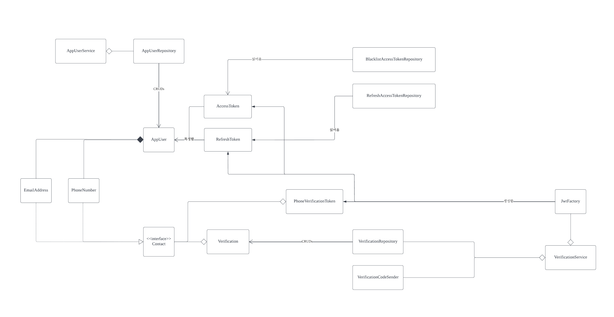

# 개요
대규모 Ecommerce와 같이 트래픽이 높고 금전거래 때문에 보안이 중요한 서비스에서는 보안이 상당히 중요합니다.

이번 프로젝트의 핵심은 보안에 맞추었습니다.

대규모의 경우 클라우드 환경에서 서비스 하는데, scale out이나, MSA처럼 다양한 각 기능별로 서버를 구현하는 경우, session은 부하가 너무 심하여 클라이언트가 인가 정보를 가지고 있는 JWT를 사용하기로 하였습니다.
JWT는 Session Storage를 거치지 않기 때문에 빠르고, 확장할때 용이합니다.

여러가지 해킹 기법에 대하여 미리 공부하고 대비를 해보았습니다.
* MITM 
  * Token을 사용할때 제일 위험한 공격이라고 생각됩니다. Access Token과 Refresh Token을 나누어 한번 뺏겨도 짧은 기간 내에 만료가 되어 효용이 없도록 방어했습니다.
  * Insufficient Authentication, Weak Password Recovery Validation
    * 위 부분들은 해킹 기법보다는 취약점에 가깝습니다. 본인인증을 통한 Multi-Factor Authentication으로 방어했습니다.
  * CSRF의 경우, Spring Security의 Filter를 통해 방어했습니다.


## 주요 포인트
### 클래스 다이어그램


## 주요 로직
#### 1. 회원가입 로직


#### 2. 로그인 로직


#### 3. 비밀번호 재설정 로직


## 로컬 실행 방법

```shell
sudo docker build --build-arg CS_API_KEY=[KEY] --build-arg CS_API_SECRET=[SECRET] --build-arg CS_FROM_NUMBER=01084273267 --build-arg SECRET=[SERVER_SECRET] -t user-auth .
sudo docker run -v user_authentication:/workspace/app  -v :/workspace/app/build -p 8080:8080 user-auth
```

## 사용기술
* Spring & Kotlin
* Spring Security
* Docker
* JWT
* CoolSms API

# 구현 스펙
## API 설계

###### API Reference

<details markdown="1">
<summary>유저 인증 및 인가</summary>

<details markdown="1" style="margin-left:14px">
<summary>/verifications</summary>

**전화 본인 인증코드 발송**
----
요청 받은 정보를 토대로 Multi-factor authentication 인증 세션을 생성하여
인증 코드를 보냅니다.

* **URL**

  /verifications/phones

* **Method:**

  `POST`

* **Request Body**

  **Required:**

  * `countryCode=[String] - 전화번호의 국가 코드 (예 : 82)`  
  * `phoneNumber=[String] - 국가 코드를 제외한 전화번호 (예 : 1012341234 )`

* **Response**

  **Required:**

  * `status=[String] - 요청 처리 후 상태 코드`  
  * `message=[String] - 요청 처리 후 상태 메시지`

* **Success Response:**
```
HTTP/1.1 200 Created
Content-type: application/json;charset=UTF-8
{
    "status": "OK",
    "message": "Successfully sent verification code to request phone number",
    "data": null
}
```

**본인 인증**
----

* **URL**

  /verifications/phones/verify

* **Method:**

  `DELETE`

* **Request Body**

  **Required:**

  * `countryCode=[String] - 전화번호의 국가 코드 (예 : 82)`  
  * `phoneNumber=[String] - 국가 코드를 제외한 전화번호 (예 : 1012341234 )`
  * `verificationCode=[String] - 6자리 인증 코드 (예 : 1012341234 )`

* **Response**

  **Required:**

  * `status=[String] - 요청 처리 후 상태 코드`  
  * `message=[String] - 요청 처리 후 상태 메시지`
  * `data=[String] - 인증한 전화번호로 생성한 JWT 토큰. 회원가입이나 비밀번호 재설정 시 해당 값을 보내야지만 동작 수행 가능`

* **Success Response:**
```
HTTP/1.1 200 Ok
Content-type: application/json;charset=UTF-8
{
    "status": "OK",
    "message": "Successfully verified the phone number",
    "data": "TOKEN"
}
```

</details>

<details markdown="1" style="margin-left:14px">
<summary>/users</summary>

**유저 정보 조회**
----
유저가 본인의 정보를 열람합니다.

* **URL**

  /users/mine

* **Method:**

  `GET`

* **Headers:**
  `Authorization=[String] - Bearer 로 시작하는 access token. 해당 정보가 있어야 본인 정보를 열람할 수 있음.`

* **Response**

  **Required:**  
  * `status=[String] - 요청 처리 후 상태 코드`  
  * `message=[String] - 요청 처리 후 상태 메시지`
  * `data=[Map<String, Any>] - 인증한 전화번호로 생성한 JWT 토큰. 회원가입이나 비밀번호 재설정 시 해당 값을 보내야지만 동작 수행 가능`
  * `email=[String] - 유저의 이메일`
  * `phonenumber=[String] - 유저의 전화번호`
  * `name=[String] - 유저의 이름`
  * `nicknm=[String] - 유저의 닉네임`

* **Success Response:**
```
HTTP/1.1 200 OK
Content-type: application/json;charset=UTF-8
{
    "status": "OK",
    "message": "Successfully found user",
    "data": {
        "name": "Sam",
        "id": "USER_0",
        "email": {
            "emailAddress": "organicyellow0608@gmail.com",
            "destination": "organicyellow0608@gmail.com"
        },
        "phoneNumber": {
            "phoneNumber": "821084273267",
            "destination": "821084273267"
        },
        "nicknm": "Sam"
    }
}
```

**유저 회원 가입**
----
전화번호로 인증된 유저가 회원가입을 할 수 있습니다. 

* **URL**

  /users

* **Method:**

  `POST`

* **Headers:**
  `Authorization=[String] - Bearer 로 시작하는 JWT token. 전화번호 정보를 포함하여 인증 받은 유저가 회원가입을 하고 있는지 검사함`

* **Request Body**

  **Required**
  * `nickname=[String] - 유저 닉네임`
  * `name=[String] - 유저 이름`
  * `email=[String] - 유저 닉네임`
  * `password=[String] - 유저 비밀번호`

* **Response**

  **Required:**  
  * `status=[String] - 요청 처리 후 상태 코드`  
  * `message=[String] - 요청 처리 후 상태 메시지`
  * `data=[Map<String, Any>] - 인증한 전화번호로 생성한 JWT 토큰. 회원가입이나 비밀번호 재설정 시 해당 값을 보내야지만 동작 수행 가능`
    * `email=[String] - 유저의 이메일`
    * `phonenumber=[String] - 유저의 전화번호`
    * `name=[String] - 유저의 이름`
    * `nicknm=[String] - 유저의 닉네임`
    * `password=[String] - 유저의 암호화된 비밀번호`

* **Success Response:**
```
HTTP/1.1 200 OK
Content-type: application/json;charset=UTF-8
{
    "status": "OK",
    "message": "Successfully found user",
    "data": {
        "name": "Sam",
        "id": "USER_0",
        "email": {
            "emailAddress": "organicyellow0608@gmail.com",
            "destination": "organicyellow0608@gmail.com"
        },
        "phoneNumber": {
            "phoneNumber": "821084273267",
            "destination": "821084273267"
        },
        "nicknm": "Sam"
    }
}
```

**유저 로그인**
----
DB에 저장된 유저가 로그인합니다.

* **URL**

  /users/log-in

* **Method:**

  `POST`

* **Request Body** 
  
  **Required:**
  * `uername=[String] - 유저 식별자(닉네임, 이메일, 전화번호 3개 중 하나로 제공되면 됨)`
  * `password=[String] - 유저 비밀번호`

* **Response**

  **Required:**
  * `accessToken=[String] - 유저의 access token`
  * `refreshToken=[String] - 유저의 refresh token`

* **Success Response:**
```
HTTP/1.1 200 OK
Content-type: application/json;charset=UTF-8
{
    "accessToken": "",
    "refreshToken": ""
}
```

**비밀번호 재설정**
----
유저가 로그인 되어있지 않은 상태에서 본인 인증 후 비밀번호를 재설정할 수 있는 API입니다.

* **URL**

  /users/reset-password

* **Method:**

  `PUT`

* **Headers:**
  `Authorization=[String] - Bearer 로 시작하는 JWT token. 전화번호 정보를 포함하여 인증 받은 유저가 회원가입을 하고 있는지 검사함`
* **Request Body**

  **Required:**
  * `password=[String] - 새 비밀번호`
  * `newPssword=[String] - 새 비밀번호와 일치하는 비밀번호`

* **Response**

  **Required:**
  * `accessToken=[String] - 유저의 access token`
  * `refreshToken=[String] - 유저의 refresh token`

* **Success Response:**
```
HTTP/1.1 200 OK
Content-type: application/json;charset=UTF-8
{
    "status": "OK",
    "message": "Successfully reset password",
    "data": null
}
```

**토큰 갱신**
----
유저의 Access Token이 만료되었을때 Refresh Token을 이용해서 갱신할 수 있는 API입니다.

* **URL**

  /users/refresh-token

* **Method:**

  `GET`

* **Headers:**
  `Authorization=[String] - Bearer 로 시작하는 Refresh token.`

* **Response**

  **Required:**
  * `accessToken=[String] - 유저의 갱신된 access token`

* **Success Response:**
```
HTTP/1.1 200 OK
Content-type: application/json;charset=UTF-8
{
    "status": "OK",
    "message": "Successfully reset password",
    "data": {
        "accessToken": ""
    }
}
```
